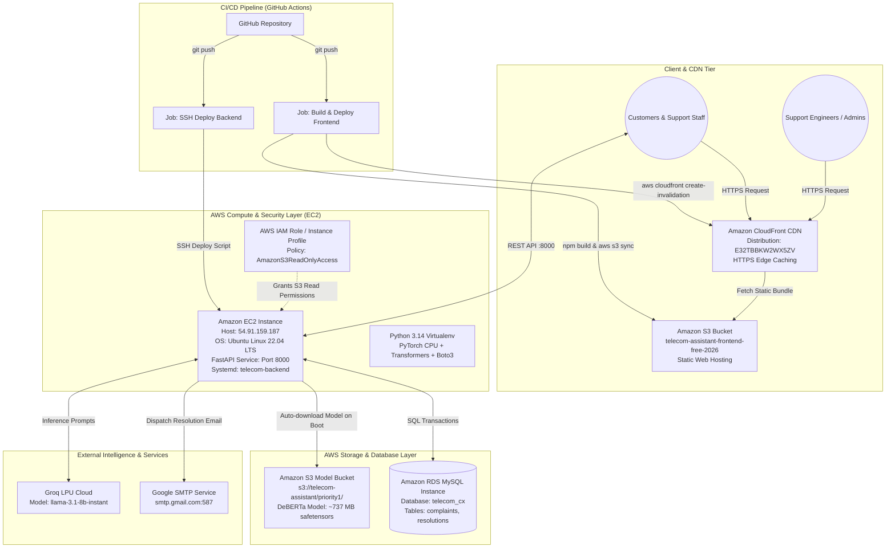

# Telecom-Compliant Intelligence & Automated Resolution Assistant
## Master Project Architecture, AWS Cloud Infrastructure & Technical Documentation

---

## 1. Executive System Overview

The **Telecom-Compliant Intelligence and Automated Resolution Assistant (SignalCX v2.4 Core)** is an enterprise-grade, cloud-native customer experience (CX) intelligence platform designed for telecommunications operators. 

The system leverages:
* **Hybrid Deep Learning & Transformers** (Fine-tuned DeBERTa-v2 for Severity, DistilBERT for Urgency, Scikit-learn Classifiers for Category Mapping).
* **RAG Engine (Retrieval-Augmented Generation)**: Vector embeddings via `SentenceTransformer` and ChromaDB vector store backed by Groq LPU (`llama-3.1-8b-instant`).
* **Cloud-Native AWS Hosting**: Decoupled serverless frontend distribution (S3 + CloudFront), high-throughput FastAPI inference compute on Amazon EC2, managed AWS RDS MySQL for persistence, and S3 for model weight storage.
* **Full-Duplex Email Resolution Service**: Automated technician resolution dispatch via SMTP.
* **Widescreen Glassmorphic Frontend**: Built with React, Vite, Lucide Icons, and dynamic visual telemetry.

---

## 2. AWS Cloud Architecture & Infrastructure Topology



---

## 3. Detailed AWS Services Implementation Guide

### 3.1 Amazon S3 (Simple Storage Service)
The platform uses **two dedicated S3 buckets** for distinct operational concerns:

#### A. Model Storage Bucket (`s3://telecom-assistant/`)
* **Prefix / Directory**: `priority1/`
* **Contents**:
  * `severity_outputs/severity_transformer/model.safetensors` (**737.7 MB**)
  * `spm.model` (2.46 MB)
  * `tokenizer.json` (9.16 MB)
  * Model configurations and tokenizer settings (`config.json`, `tokenizer_config.json`)
* **Role**: Serves as the central binary artifact repository. Bypasses GitHub's 100 MB single-file limitation, enabling instant model hydration on EC2 during server spin-up without storing giant binaries in Git.

#### B. Frontend Web Hosting Bucket (`telecom-assistant-frontend-free-2026`)
* **Role**: Configured for static website hosting, storing compiled React production builds (`index.html`, minified JavaScript chunks, CSS stylesheets, icons).
* **Sync Mechanism**: Synchronized automatically on push by GitHub Actions (`aws s3 sync frontend/dist/ s3://... --delete`).

---

### 3.2 Amazon CloudFront (Global Content Delivery Network)
* **Distribution ID**: `E32TBBKW2WX5ZV`
* **Origin**: Connected directly to the S3 frontend bucket.
* **Features**:
  * Edge-cached content delivery worldwide with sub-second page loads.
  * Automatic HTTPS encryption.
  * **Cache Invalidation Workflow**: Every CI/CD deployment executes `aws cloudfront create-invalidation --distribution-id E32TBBKW2WX5ZV --paths "/*"` to immediately refresh edge caches and prevent stale UI sessions.

---

### 3.3 Amazon EC2 (Elastic Compute Cloud)
* **Instance Public IP**: `54.91.159.187`
* **Operating System**: Ubuntu 22.04 LTS
* **Service Manager**: `systemd` daemon managing `telecom-backend.service`
* **Runtime**:
  * Python virtual environment (`.venv`)
  * Uvicorn ASGI Server serving FastAPI on `0.0.0.0:8000`
  * CPU-optimized PyTorch runtime (`--index-url https://download.pytorch.org/whl/cpu`)
* **Environment Variables**: Managed in `.env` (Database connections, Groq API keys, SMTP credentials, S3 bucket names).

---

### 3.4 AWS IAM (Identity & Access Management)
* **Instance Profile**: `EC2-S3-Model-Read-Role` attached to the EC2 compute instance.
* **Assigned Policy**: `AmazonS3ReadOnlyAccess` (specifically scoped to `s3://telecom-assistant/*`).
* **Security Rationale**: Eliminates the risk of hardcoding AWS Access Keys and Secret Keys in code repositories. The `boto3` SDK automatically requests temporary security credentials via the EC2 Instance Metadata Service (IMDSv2).

---

### 3.5 Amazon RDS (Relational Database Service) - MySQL
* **Database Name**: `telecom_cx`
* **Driver / ORM**: SQLAlchemy 2.0 with `pymysql` and `cryptography`
* **Connection String**: `mysql+pymysql://admin:***@<RDS_ENDPOINT>:3306/telecom_cx`
* **Schema Entities**:
  * `complaints`: Stores ticket ID, customer account number, issue description, category, detected urgency, predicted severity, calculated priority (P1–P4), and status (`Open`, `In Progress`, `Resolved`).
  * `resolutions`: Stores technician assignment, AI-generated resolution response, root cause analysis, and customer feedback.
* **Fallback Mode**: If RDS is unreachable in offline development, the system seamlessly falls back to a local SQLite engine (`sqlite:///./telecom_data.db`).

---

## 4. Large Model Decoupling & Auto-Hydration (`model_downloader.py`)

### The 100 MB Git Restriction Challenge
Deep learning transformers (e.g., DeBERTa-v2 sequence classifier weights at **737.7 MB**) exceed GitHub’s 100 MB hard limit. Forcing large binaries into Git leads to fatal push errors and repository bloat.

### The Solution Architecture
1. **`.gitignore` Rules**: Explicitly excludes all model weight patterns:
   ```gitignore
   # Large Model Files
   *.h5
   *.pt 
   *.pth 
   *.onnx
   *.bin
   *.safetensors
   *.model
   models/
   *.joblib
   severity_outputs/
   priority1/severity_outputs/
   ```
2. **Automated Hydration Engine (`model_downloader.py`)**:
   Provides idempotent single-file and directory syncing via S3 pagination:
   ```python
   def ensure_model_directory(s3_prefix="priority1/", local_dir="priority1", bucket_name="telecom-assistant"):
       # Checks if model files exist locally; if not, streams from S3
   ```
3. **On-Demand Loading in `priority1/priority_model.py`**:
   Before initializing PyTorch and HuggingFace tokenizers, `_load_severity_model()` verifies whether `model.safetensors` exists on disk. If absent, it automatically triggers `ensure_model_directory("priority1/", ...)` from S3.

---

## 5. Automated CI/CD Pipeline (`.github/workflows/deploy.yml`)

The GitHub Actions pipeline automates zero-downtime continuous integration and continuous deployment:

```yaml
name: 🚀 Automatic AWS CI/CD Deployment

on:
  push:
    branches:
      - main
      - master
      - 'feature/**'

jobs:
  deploy-frontend-s3:
    name: 📦 Build & Deploy Frontend to AWS S3
    runs-on: ubuntu-latest
    steps:
      - uses: actions/checkout@v4
      - uses: actions/setup-node@v4
        with: { node-version: 18, cache: 'npm', cache-dependency-path: 'frontend/package-lock.json' }
      - run: cd frontend && npm ci && npm run build
        env:
          VITE_API_BASE_URL: "http://54.91.159.187:8000"
      - uses: aws-actions/configure-aws-credentials@v4
        with:
          aws-access-key-id: ${{ secrets.AWS_ACCESS_KEY_ID }}
          aws-secret-access-key: ${{ secrets.AWS_SECRET_ACCESS_KEY }}
          aws-region: ${{ secrets.AWS_REGION || 'us-east-1' }}
      - run: aws s3 sync frontend/dist/ s3://${{ secrets.AWS_S3_BUCKET || 'telecom-assistant-frontend-free-2026' }}/ --delete
      - run: aws cloudfront create-invalidation --distribution-id ${{ secrets.CLOUDFRONT_DISTRIBUTION_ID || 'E32TBBKW2WX5ZV' }} --paths "/*" || true

  deploy-backend-ec2:
    name: 🖥️ Deploy FastAPI Backend to AWS EC2
    runs-on: ubuntu-latest
    needs: deploy-frontend-s3
    steps:
      - uses: appleboy/ssh-action@v1.0.3
        with:
          host: ${{ secrets.EC2_HOST || '54.91.159.187' }}
          username: ${{ secrets.EC2_USERNAME || 'ubuntu' }}
          key: ${{ secrets.EC2_SSH_KEY }}
          port: 22
          script: |
            cd ~/Telecom-compliant-intelligence-and-automated-resolution-assistant
            git fetch origin
            git reset --hard origin/feature/add-email-and-widescreen-dashboard || git pull origin main
            source .venv/bin/activate
            pip install --no-cache-dir torch --index-url https://download.pytorch.org/whl/cpu
            pip install --no-cache-dir -r requirements.txt
            sudo systemctl restart telecom-backend
```

---

## 6. Frontend Enhancements & UI/UX Evolution

### 6.1 Design System & Aesthetic Foundation
* **Theme & Palette**: Dark zinc aesthetic (`bg-zinc-950`, `border-zinc-800/80`, `text-zinc-100`) with emerald/accent telemetry pulses.
* **Layout**: Full-width **Widescreen Dashboard Layout** with subtle dot matrix background (`bg-grid-pattern`).
* **Visual Components**:
  * `SpotLightCard.jsx`: Radial cursor-following illumination for cards.
  * `Particles.jsx`: Subtle background particle physics.
  * `BlurText.jsx`: Progressive character de-blur animations for AI resolutions.
  * `Lucide React`: Clean SVG iconography (`Activity`, `ShieldCheck`, `AlertTriangle`, `Send`, `CheckCircle2`).

### 6.2 Customer & Admin Complaint Interface (`ComplaintForm.jsx`)
* **Real-time Diagnostic Stream**:
  * Real-time Category Detection (Billing, Network, Roaming, Hardware, Internet).
  * Urgency Engine badge (`LOW`, `NEUTRAL`, `HIGH`, `CRITICAL`).
  * Severity Engine metric (`LOW`, `MEDIUM`, `HIGH`, `CRITICAL`).
  * Computed Priority Badge (`P1 Critical`, `P2 High`, `P3 Medium`, `P4 Low`).
* **Email Notification Field**: Seamlessly captures customer and technician email addresses for immediate resolution delivery.
* **Resolution Engine Panel**: Displays the RAG knowledge source, matched resolution procedure, and root cause analysis generated by Groq LPU.

### 6.3 Dedicated Admin Management Portal (`admin/`)
* Built with a responsive administrative console (`admin/app.js`, `admin_credentials.json`) allowing support managers to:
  * Monitor the incoming complaint queue in real-time.
  * Reassign tickets or escalate P1/P2 incidents.
  * View database health metrics and system logs.

---

## 7. Model Reasoning & Priority Decision Logic

The priority engine combines Severity and Urgency into a unified action matrix:

$$\text{Combined Score} = (0.60 \times \text{Normalized Severity}) + (0.40 \times \text{Normalized Urgency})$$

```
+------------------+-------------------------------------------------------+
| Priority Level   | Trigger Conditions                                    |
+------------------+-------------------------------------------------------+
| P1 (Critical)    | Urgency is CRITICAL OR Severity is CRITICAL           |
| P2 (High)        | Combined Score >= 0.70 OR High Urgency + Negative     |
| P3 (Medium)      | Combined Score >= 0.40                                |
| P4 (Low)         | Combined Score < 0.40 (Routine inquiries/minor bugs)  |
+------------------+-------------------------------------------------------+
```

---

## 8. Operational Runbook & Cheat Sheet

### Running Backend Locally
```powershell
cd Telecom-compliant-intelligence-and-automated-resolution-assistant-main
.\.venv\Scripts\Activate.ps1
pip install -r requirements.txt
python model_downloader.py   # Pre-syncs S3 models
uvicorn main:app --host 0.0.0.0 --port 8000 --reload
```

### Running Frontend Locally
```powershell
cd frontend
npm install
npm run dev
```

### Checking EC2 Backend Health (via SSH)
```bash
sudo systemctl status telecom-backend
journalctl -u telecom-backend -n 50 -f
```
